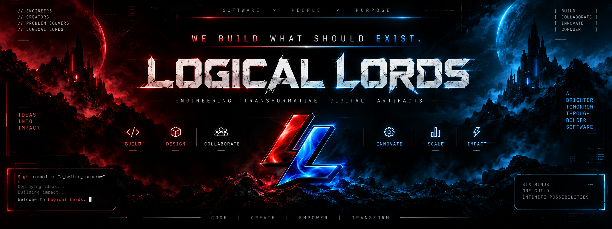

<p align="center">
  
</p>

<p align="center">
  <strong>A SOFTWARE DEVELOPMENT & INTELLIGENCE COLLECTIVE // SIX FOUNDERS · DUAL-ENGINE CORE</strong>
</p>

<p align="center">
  <a href="#-the-six-founders"></a>
  <a href="#-tech-stack"></a>
  <a href="#-tech-stack"></a>
  <a href="#-interactive-systems"></a>
  <a href="#-license"></a>
</p>

---

## ⚡ Manifesto

> ### *"WE BUILD WHAT SHOULD EXIST."*
>
> Engineering digital products with clarity, mathematical precision, and raw creative velocity. From first principles to planetary scale execution — we design, build, and ship what matters.

**Logical Lords** is an elite software development and intelligence collective forged by six domain architects. The platform embodies a brutalist, cyberpunk-inspired design language powered by a **Dual-Engine Core**: the visceral, dynamic energy of **Red Plasma** balanced with the ruthless architectural calculation of **Blue Lightning**.

---

## 🏛️ The Six Founders

Six specialists combining deep technical execution, systems infrastructure, and human-centric interaction design:

| # | Codename | Architect | Core Domain | Superpower & Specialization |
|---|---|---|---|---|
| **01** | **`VOLT`** | **VarunRaj P** | **Product & System Architecture** | *Quantum Blueprinting* — Translates ambiguous zero-to-one visions into resilient, planet-scale software architectures. |
| **02** | **`CIPHER`** | **Vijay Kumar K** | **Full Stack & Runtime Systems** | *Algorithmic Transmutation* — Bridges low-latency microservices with high-throughput, reactive client runtimes. |
| **03** | **`NOVA`** | **Sudharsan C** | **AI & Intelligent Systems** | *Cosmic Pattern Sight* — Neural pipelines, agentic orchestration, vector mathematics, and factual RAG architectures. |
| **04** | **`BLAZE`** | **Vignesh R** | **Mobile & High-FPS Surfaces** | *Kinetic Ergonomics* — Native mobile engines, GPU shaders, tactile gesture telemetry, and 120 FPS fluid interfaces. |
| **05** | **`TITAN`** | **Varunan K M** | **Systems & Cloud Infrastructure** | *Indestructible Bastion* — Multi-region Kubernetes mesh, zero-trust security, chaos engineering, and edge resilience. |
| **06** | **`SAGE`** | **Tamil Selvan** | **Creative Tech & Human Experience** | *Harmonic Synthesis* — Harmonizes raw computational horsepower with intuitive ergonomics, typography, and empathy. |

---

## ✨ Architectural Highlights & Interactive Features

### 1. 🌌 Atmospheric Ambient Dual Glow
- **Diminished Left Crimson Aura**: Deep red plasma light softly diffused along the left flank of the canvas (`radial-gradient`, low optical brightness).
- **Diminished Right Azure Aura**: Electric blue light diffused down the right edge, framing content without compromising dark-mode legibility.

### 2. 🛡️ Organic Insignia Silhouette
- Crest emblem with full 32-bit alpha transparency (no rigid containment boxes or square borders).
- Custom `filter: drop-shadow(...)` conforming directly to the metallic wings and shield contour.

### 3. 💡 Phosphorescent Hover Illumination
- Hovering over titles, metrics, and cards triggers vivid chromatic halos (Cyan `#00E5FF`, Red `#FF2A2A`, Violet `#7C3AED`).
- Interactive glow preset engine: switch dynamically between **Logical Lords**, **Spectrum Prism**, **Neon Tokyo**, and **Quantum Flux**.

### 4. 🎛️ Synthesized Cyber Web Audio FX
- Built-in zero-dependency Web Audio API sound synthesizer (`src/lib/audio.ts`).
- Generates procedural retro-futuristic bleeps, warp hums, and cosmic notification chords with instant global mute toggle.

### 5. 🌀 ASCII Vortex Particle Engine
- Hardware-accelerated canvas background rendering real-time streaming typography and character constellations (`0123456789.:/\\+-*#%░▒▓█`).

### 6. 🕹️ Comic-Hero Dossier Panels & Encrypted Dispatch
- Interactive founder comic hero modals with power radar metrics and battle gear loadouts.
- Direct-to-founders terminal contact form with state validation and instant transmission feedback.

---

## 🚀 Flagship Artifacts

- **`NEXUS`** — Intelligent workspace uniting real-time canvas collaboration, neural semantic knowledge indexing, and sub-18ms sync latency.
- **`WILDBUGS`** — Autonomous chaos engineering and visual regression suite simulating distributed edge failures before production rollout.
- **`ORBIT`** — Unified cross-platform creator suite running 120 FPS hardware-accelerated audio processing and spatial distribution.
- **`KAIROS`** — High-frequency cognitive telemetry aggregator and deep-work calendar optimization engine.

---

## 🛠️ Tech Stack

```
Frontend Runtime       ───  React 19 (TypeScript) + Vite 6
Styling & Tokens       ───  Tailwind CSS v4 + Custom Cyber Typography
Vector Graphics & Icons───  Lucide React
Audio Synthesis Engine ───  Native Web Audio API (Sine / FM Procedural Synthesis)
Generative Visuals     ───  HTML5 Canvas Matrix / ASCII Stream Engine
Animations             ───  Framer Motion / Motion
Type Safety            ───  Strict TypeScript (Zero `any`)
```

---

## 📁 Repository Structure

```
.
├── banner.png                     # Official Logical Lords Project Banner (2048x768)
├── public/
│   ├── banner.png                 # Web asset mirror for documentation & preview
│   ├── logo.png                   # Transparent insignia crest emblem
│   └── logical-lords-logo.png     # Brand asset mirror
├── src/
│   ├── components/
│   │   ├── About.tsx              # Architectural pipeline & topological flow (6 → ∞)
│   │   ├── AsciiVortexCanvas.tsx  # Dynamic ASCII constellation canvas background
│   │   ├── Capabilities.tsx       # Core engineering competencies
│   │   ├── CinematicBreak.tsx     # Full-width brand manifesto reveal
│   │   ├── Contact.tsx            # Terminal dispatch communication channel
│   │   ├── Footer.tsx             # System status & collective copyright
│   │   ├── FounderModal.tsx       # Detailed comic hero dossier modal
│   │   ├── Founders.tsx           # Comic panel dossier gallery for the 6 founders
│   │   ├── Hero.tsx               # Primary statement, brand crest & quick launch
│   │   ├── LoadingScreen.tsx      # Terminal boot sequence with ASCII diagnostics
│   │   ├── MouseGlowSpotlight.tsx # Interactive hover glow engine & palette switcher
│   │   ├── Navbar.tsx             # Minimalist HUD navigation with audio control
│   │   ├── ProjectModal.tsx       # Deep-dive architecture viewer for portfolio
│   │   ├── ScrollTransition.tsx   # Smooth section transition wrapper
│   │   └── Work.tsx               # Interactive flagship project portfolio
│   ├── lib/
│   │   ├── asciiData.ts           # Founders data, projects, capabilities, and metrics
│   │   └── audio.ts               # Procedural Web Audio synthesizer
│   ├── App.tsx                    # Root orchestrator & ambient lighting shell
│   ├── index.css                  # Global Tailwind v4 directives & glowing glow styles
│   ├── main.tsx                   # React entry point
│   └── types.ts                   # Domain models (Founder, Project, Capability, etc.)
├── index.html                     # HTML5 root entry point
├── metadata.json                  # AI Studio project metadata & capabilities
├── package.json                   # Dependencies & npm scripts
├── tsconfig.json                  # Strict TypeScript compiler options
└── vite.config.ts                 # Vite bundler configuration
```

---

## 💻 Getting Started

### Prerequisites
- **Node.js**: v18.0.0 or higher
- **npm** or **pnpm** / **yarn**

### Installation

```bash
# Clone the repository
git clone https://github.com/your-org/logical-lords.git

# Navigate into project directory
cd logical-lords

# Install dependencies
npm install
```

### Development Server

Start the local development server with hot-reload:

```bash
npm run dev
```

Open [http://localhost:3000](http://localhost:3000) (or the port indicated in your console) to view the application.

### Production Build

Build the production-ready static assets:

```bash
npm run build
```

Preview the production build locally:

```bash
npm run preview
```

### Type Checking & Linting

```bash
npm run lint
```

---

## 🎨 Design System & Visual Philosophy

- **Canvas**: Pure void `#000000` with subtle peripheral red/blue atmospheric gradients.
- **Typography Hierarchy**:
  - Display & Headlines: Heavy geometric grotesk (`Syne`, `Space Grotesk`, `Chakra Petch`)
  - Telemetry & Metadata: Monospace data streams (`JetBrains Mono`, `Share Tech Mono`)
- **Interaction Feedback**:
  - Sub-millisecond phosphorescent text-shadow expansion on hover.
  - Frequency-modulated sine tone feedback upon user actions.
  - Borderless, organically glowing crest insignia.

---

## 📜 License

Distributed under the **MIT License**. See `LICENSE` for more information.

---

<p align="center">
  <strong>LOGICAL LORDS COLLECTIVE</strong><br />
  <em>VarunRaj P · Vijay Kumar K · Sudharsan C · Vignesh R · Varunan K M · Tamil Selvan</em><br />
  <sub>BUILT WITH PURPOSE // CRAFTED WITH OBSESSION</sub>
</p>
